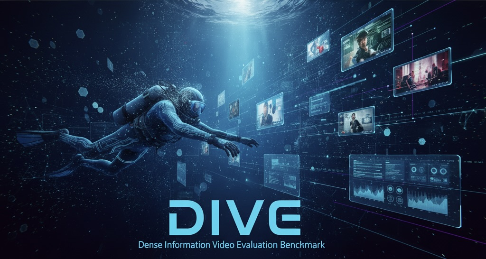

# 🤿 DENSE VIDEO UNDERSTANDING WITH GATED RESIDUAL TOKENIZATION

### Dense Information Video Evaluation (DIVE) Benchmark

<p align="center">
  <a href="https://arxiv.org/abs/2509.14199">
    
  </a>
  <a href="paper/ECCV_Dense_Video_Understanding.pdf">
    
  </a>
  <a href="https://www.zhanghaichao.xyz/DenseVideoUnderstand/">
    
  </a>
  <a href="https://www.zhanghaichao.xyz/DenseVideoUnderstand/leaderboard.html">
    
  </a>
  <a href="https://huggingface.co/datasets/haichaozhang/DenseVideoEvaluation">
    
  </a>
</p>

## 👥 Authors

<p align="center">
  <a href="https://zhanghaichao.xyz"><b>Haichao Zhang<sup>1</sup></b></a> ·
  <a href="https://wenhaochai.com/"><b>Wenhao Chai<sup>2</sup></b></a> ·
  <a href="https://shwai-he.github.io/"><b>Shwai He<sup>3</sup></b></a> ·
  <a href="https://www.ang-li.com/"><b>Ang Li<sup>3</sup></b></a> ·
  <a href="https://www1.ece.neu.edu/~yunfu/"><b>Yun Fu<sup>1</sup></b></a>
</p>
<p align="center">
  <sub><b>1</b> Northeastern University &nbsp;|&nbsp; <b>2</b> Princeton University &nbsp;|&nbsp; <b>3</b> University of Maryland, College Park</sub>
</p>

**DIVE-Bench** evaluates video-language models on tasks where useful evidence is
distributed densely over time. **Gated Residual Tokenization (GRT)** explores how
to reduce redundant visual-token computation while retaining changing content.
This repository provides the benchmark tasks, GRT implementations, evaluation
tools, and reproducible numerical leaderboards.

<p align="center">
  
</p>

The [arXiv paper](https://arxiv.org/abs/2509.14199) introduces the earlier
Educational scope; the [revised manuscript](paper/ECCV_Dense_Video_Understanding.pdf)
includes both Educational and High-Motion tasks.

## 🔍 What is DIVE?

**Dense Information Video Evaluation (DIVE)** studies video understanding beyond
isolated keyframes. Educational videos require recovering information from
subtitles and visual text, while high-motion videos test fine-grained spatial
trajectories across time.

| Paper task | Evaluation task ID | Scope |
| --- | --- | --- |
| [Educational High-FPS Videos](https://huggingface.co/datasets/haichaozhang/DenseVideoEvaluation) | `dive_bench_educational_high_fps` | 634 QA / 317 videos |
| [High-Motion High-FPS Videos](https://huggingface.co/datasets/haichaozhang/highmotion_densevideounderstand) | `dive_bench_high_motion_high_fps` | 3,243 examples |

The fixed High-Motion preview uses
`dive_bench_high_motion_high_fps_preview1000` (the first 1,000 examples).
Preview and full-split results are separate protocols.

Dataset access and video licenses are separate from the code release. At the
release audit, Educational was gated; High-Motion and the combined two-task entry
were private. See [dataset setup and task configurations](docs/DATASET_RELEASE.md).

## 🔍 What is GRT?

**Gated Residual Tokenization** combines motion-based gating with reuse of
previous patch embeddings to reduce redundant visual patch computation.
The release includes Educational profiles for LLaVA-OneVision **0.5B** (`route31`)
and Qwen2.5-VL **3B / 7B** (`qwen3` / `qwen7`), plus a separate
**HF LLaVA-OneVision 0.5B** High-Motion recipe.

## ⚙️ Quick start

### Generate the leaderboard — CPU only

No dataset, model download, or GPU is needed to verify and export the published
numeric evidence:

```bash
git clone --branch main --single-branch \
  https://github.com/Hai-chao-Zhang/DenseVideoUnderstand.git DIVE-Bench
cd DIVE-Bench
python -m pip install 'PyYAML>=6'
python -m tools.densevideo.build_complete_leaderboard --verify-only
python -m tools.densevideo.build_complete_leaderboard --output outputs/complete
```

Open `outputs/complete/leaderboard.html`: **29 Educational results, 19 High-Motion
v2 preview results, and 12 comparison rows**. This verifies saved results, not
new model inference. [Leaderboard generation details →](docs/COMPLETE_LEADERBOARD.md)

### Evaluate and reproduce GRT

From the checkout, use a dedicated Python **3.10 or 3.11** environment:

```bash
python -m venv .venv
source .venv/bin/activate
python -m pip install -e '.[test,reference]'
python -m tools.densevideo.reproduce_grt --profile route31 --output outputs/route31
```

The last command prints a plan only. After authorized data/model setup and a
compatible CUDA installation, execute the matched Educational arms:

```bash
CUDA_VISIBLE_DEVICES=0 python -m tools.densevideo.reproduce_grt \
  --profile route31 --output outputs/route31-full --execute --with-mos
```

`--with-mos` also runs a 32B judge and requires sufficient GPU memory.
Do not install alongside upstream `lmms-eval`; both use the same namespace.
Use the [Educational setup and evaluation guide](docs/REPRODUCTION.md) or
[High-Motion v2 generation and corrected-reference scoring guide](docs/HIGHMOTION_V2_REPRODUCTION.md)
for data preparation, pinned settings, and complete commands.

## 📊 Results and reproducibility

See the [interactive leaderboard](https://www.zhanghaichao.xyz/DenseVideoUnderstand/#leaderboard)
or [complete HTML tables](https://www.zhanghaichao.xyz/DenseVideoUnderstand/leaderboard.html).

On the **1,000-example High-Motion v2 preview** (861 valid-reference records),
HF 0.5B GRT improves Grid Accuracy from **0.0468682595 to 0.0495036226**.
Four of five metrics improve; Transition Accuracy decreases. Baselines reuse
archived predictions rescored against the corrected GT; only GRT ran new GPU
inference. This is not a fresh byte-identical paired run or full-split result.
[All metrics, coverage, and protocol limits →](docs/HIGHMOTION_V2_RESULTS.md)

Educational scores reproduce the **2026-08-20 numerical snapshot**, not a fresh
full GPU rerun. Paper/protocol differences, matched controls, and the limits of
eight-frame sampling and patch-compute measurements are detailed in the
[reproduction and publication notes](docs/PUBLICATION_AUDIT.md).

## 📜 Citation

If you find DIVE-Bench or GRT useful, please cite our work and state the
paper version and evaluation protocol used:

```bibtex
@article{zhang2025dive,
  title={Dense Video Understanding with Gated Residual Tokenization},
  author={Zhang, Haichao and Chai, Wenhao and He, Shwai and Li, Ang and Fu, Yun},
  journal={arXiv preprint arXiv:2509.14199},
  year={2025}
}
```

## ⚖️ Acknowledgments and licenses

Built on [LMMS-Eval](https://github.com/EvolvingLMMs-Lab/lmms-eval). Component
notices are retained in [LICENSE](LICENSE), [LICENSE-APACHE](LICENSE-APACHE), and
[LICENSE-BSD](LICENSE-BSD). Datasets and videos retain their separate terms.
